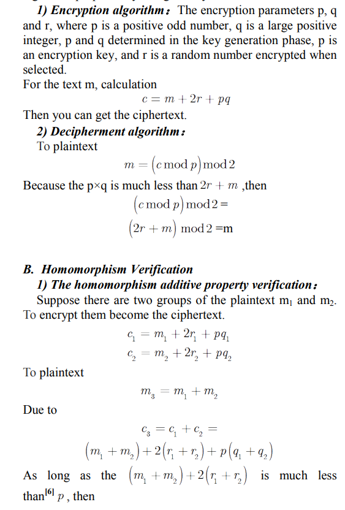

# Homomorphic Encryption

## A cloud computing security solution based on fully homomorphic encryption

The process of homomorphic encryption:

<figure><figcaption>
process of HE
</figcaption></figure>

<figure><figcaption>
continued
</figcaption></figure>

Craig Gentry construct homomorphism encryption scheme including 4 methods. They are the key generation algorithm, encryption algorithm, decryption algorithm and additional Evaluation algorithm. Fully homomorphic encryption includes two basic homomorphism types. They are the multiply homomorphic encryption algorithm and additively homomorphic encryption algorithm .The multiplication and addition with Homomorphic properties. Homomorphic encryption algorithm supports only addition homomorphism and multiplication homomorphism before 2009\[4]. Fully homomorphic encryption is to find an encryption algorithm, which can be any number of addition algorithm and multiplication algorithm in the encrypted data. For simply, this paper uses a symmetrical fully encryption homomorphic algorithm proposed by Craig Gentry.

<figure><figcaption></figcaption></figure>

1. Privacy Protection: User transmit and save their data to the cloud by encrypted. Both ensure the security of data in the process of transmission, and ensure safe storage of data. Although the cloud computing service providers handle, they can’t easily obtain the information of plaintext.
2. Data Processing: Fully homomorphic encryption mechanism enables users or the trusted third party process ciphertext data directly , instead of the original data. Users can obtain arithmetic results to decrypt to get good data. For example, in the medical information system , electronic medical records are in the ciphertext is stored in the cloud server. When the health department deal with potential safety problems , they must know some areas of certain disease location and age distribution. They can give encrypted electronic medical record data to the professional data processing services. Then they can get the correct data after decryption.
3. &#x20;The Ciphertext Retrieval: Fully homomorphic encryption technology based on ciphertext retrieval method can search directly on the ciphertext data. It is not only ensure query privacy and improve the efficiency of retrieval, the retrieval data can be added and multiply without changing the corresponding plaintext. Three generations of network defense technologies have appeared in the past. In the first generation, tools were designed to prevent or avoid intrusions. These tools usually manifested themselves as access control policies or tokens, cryptographic systems, and so forth. However, an intruder could always penetrate a secure system because there is always a weak link in the security provisioning process. The second generation detected intrusions in a timely manner to exercise remedial actions. These techniques included firewalls, intrusion detection systems (IDSes), PKI services, reputation systems, and so on. The third generation provides more intelligent responses to intrusions.
